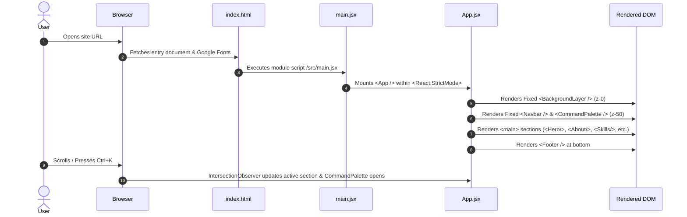
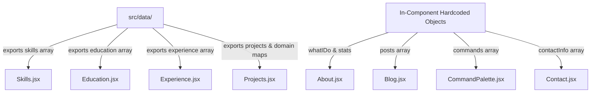
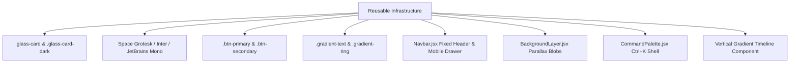
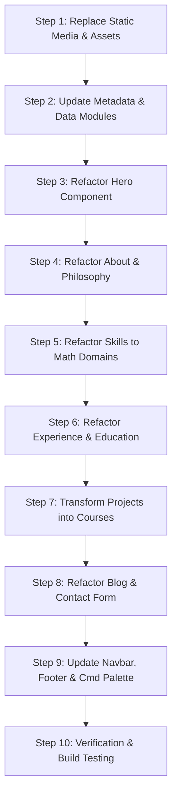

# Technical Analysis Report: Existing React Portfolio Codebase

**Target Project:** Abdennour BOUHOUNALI — Software Engineering Portfolio  
**Repository Name:** `abdennour-portfolio`  
**Analysis Purpose:** Technical audit & structural blueprint for transformation into a Mathematics Teacher Portfolio  
**Date:** August 2026  
**Status:** Read-Only Analysis (No source code modified)

---

## 1. Executive Summary

### 1.1 Purpose of the Website
The current website is a modern, high-performance, single-page developer portfolio designed for **Abdennour BOUHOUNALI**, a Software Engineer specializing in Artificial Intelligence, Computer Vision, Embedded Systems, and IoT. It serves to showcase academic background, technical skills, work history, featured engineering projects, publications (IEEE), and technical writing topics, while offering contact options and CV downloads.

### 1.2 Technologies Used
The project is built on a modern light-weight React stack:
* **Frontend Framework:** React 18.3.1 with JSX
* **Build Tool & Dev Server:** Vite 5.3.4
* **Styling Framework:** Tailwind CSS 3.4.6 with custom extensions
* **Animation Engine:** Framer Motion 11.3.0 + Custom CSS keyframe utilities
* **Icon Sets:** Lucide React (v0.400.0) & React Icons (v5.2.1)
* **Typography:** Google Fonts (*Space Grotesk*, *Inter*, *JetBrains Mono*)

### 1.3 Overall Complexity
* **Architectural Complexity:** **Low to Medium**. It follows a standard static single-page application (SPA) layout with smooth scroll section navigation (`#about`, `#skills`, `#experience`, etc.). There is no external router (`react-router-dom` is absent) and no complex state store (Redux/Zustand).
* **UI/Styling Complexity:** **High**. The design system is highly polished, utilizing glassmorphism (`backdrop-blur-md`, semi-transparent borders), radial background gradients, animated particle/blob overlays, interactive command palettes, image carousels, and staggered Framer Motion reveal animations.

### 1.4 Strengths
1. **Exceptional Aesthetic Quality:** Sleek typography, vibrant accent gradients (`#3B82F6` blue to `#8B5CF6` purple), glassmorphism cards, and subtle micro-interactions create a premium visual experience.
2. **Clean Separation of Content Data:** Domain datasets (`projects.js`, `skills.js`, `experience.js`, `education.js`) are cleanly isolated in `src/data/`, making content updates straightforward.
3. **Interactive Features:** Includes a fully functional `Ctrl+K` Command Palette (`CommandPalette.jsx`) for quick keyboard navigation and actions.
4. **Responsive & Mobile Ready:** Adapts gracefully across mobile, tablet, and desktop breakpoints with a smooth drawer menu for mobile navigation.

### 1.5 Weaknesses
1. **Form Handling is Mocked:** The contact form in `Contact.jsx` uses a simulated 1-second timeout without an active backend service (e.g., Formspree, EmailJS, or API endpoint).
2. **In-Component Hardcoded Data:** Certain datasets (e.g., Blog posts in `Blog.jsx`, stats & bio in `About.jsx`, commands in `CommandPalette.jsx`) are hardcoded directly within JSX components rather than centralized in `src/data/`.
3. **Lack of Dynamic Routing:** Navigating to specific sections relies on anchor scrolling (`#sectionId`). There are no deep-linkable dedicated routes for blog posts or detailed course pages.
4. **Image & Asset Optimization:** Images in `/public/projects/` and `src/assets/myimage.png` lack responsive `<picture>` markup or lazy-loading attributes (`loading="lazy"`).

### 1.6 Estimated Refactoring Effort
* **Total Effort Level:** **Low to Moderate (2–3 Days)**.
* **Infrastructure Reuse:** ~**85% of codebase infrastructure can be reused intact** (Tailwind tokens, CSS utility classes, Framer Motion motion wrappers, Glassmorphism components, Command Palette shell, Navbar logic, and layout containers).
* **Primary Scope of Work:** Replacing text copy, icon selection, asset images, data schemas in `src/data/`, and renaming section headers to align with a Mathematics Pedagogy & Teaching profile.

---

## 2. Technology Stack

| Package / Library | Version | Category | Purpose in Project | Reusability for Teacher Portfolio |
| :--- | :--- | :--- | :--- | :--- |
| `react` | `^18.3.1` | Core Framework | Application UI library | **100% Reuse** (Core engine) |
| `react-dom` | `^18.3.1` | DOM Renderer | React DOM mounting | **100% Reuse** |
| `vite` | `^5.3.4` | Build Tool | Dev server & production bundler | **100% Reuse** (Ultra-fast build pipeline) |
| `@vitejs/plugin-react` | `^4.3.1` | Vite Plugin | Fast Refresh & JSX support | **100% Reuse** |
| `tailwindcss` | `^3.4.6` | CSS Framework | Utility-first styling & layout | **100% Reuse** (Core design tokens) |
| `postcss` | `^8.4.38` | CSS Processor | CSS post-processing | **100% Reuse** |
| `autoprefixer` | `^10.4.19` | CSS Plugin | Vendor prefixing | **100% Reuse** |
| `framer-motion` | `^11.3.0` | Motion Library | Scroll-triggered transitions & UI animations | **100% Reuse** (Keep keyframe & stagger setups) |
| `lucide-react` | `^0.400.0` | Icon Library | Clean vector icons (Mail, Book, User, etc.) | **100% Reuse** (Add math-related icons e.g. `Calculator`, `BookOpen`, `Award`) |
| `react-icons` | `^5.2.1` | Icon Library | Supplemental icon set | **100% Reuse** |
| `@types/react` | `^18.3.3` | Types (Dev) | Type definitions for IDE support | **100% Reuse** |
| `@types/react-dom` | `^18.3.0` | Types (Dev) | Type definitions for IDE support | **100% Reuse** |

### Additional Architecture Specifications:
* **Language:** JavaScript (ES6+ with React JSX). TypeScript definitions are installed in `devDependencies`, but the codebase is written in standard `.jsx` and `.js` files.
* **Routing:** Single Page Anchor Navigation (No `react-router-dom`).
* **Markdown Support:** None installed.
* **Forms:** Handled via standard React `useState` hooks.
* **Deployment Setup:** Standard Vite build target emitting static bundle to `dist/`.

---

## 3. Folder Structure

```mermaid
graph TD
    Root[prof-portfolio/] --> Public[public/]
    Root --> Src[src/]
    Root --> ConfigFiles[Configuration Files]
    
    Public --> PublicProjects[projects/ 1..12]
    Public --> CV[CV.pdf]
    
    Src --> Assets[assets/]
    Src --> Components[components/]
    Src --> Data[data/]
    Src --> AppJsx[App.jsx]
    Src --> MainJsx[main.jsx]
    Src --> IndexCss[index.css]
    
    Assets --> MyImage[myimage.png]
    
    Components --> Navbar[Navbar.jsx]
    Components --> Hero[Hero.jsx]
    Components --> About[About.jsx]
    Components --> Skills[Skills.jsx]
    Components --> Experience[Experience.jsx]
    Components --> Education[Education.jsx]
    Components --> Projects[Projects.jsx]
    Components --> Blog[Blog.jsx]
    Components --> Contact[Contact.jsx]
    Components --> Footer[Footer.jsx]
    Components --> BackgroundLayer[BackgroundLayer.jsx]
    Components --> CommandPalette[CommandPalette.jsx]
    
    Data --> SkillsData[skills.js]
    Data --> EducationData[education.js]
    Data --> ProjectsData[projects.js]
    Data --> ExperienceData[experience.js]
    
    ConfigFiles --> TailwindCfg[tailwind.config.js]
    ConfigFiles --> ViteCfg[vite.config.js]
    ConfigFiles --> PostCSSCfg[postcss.config.js]
    ConfigFiles --> PkgJson[package.json]
```



### Detailed Folder Breakdown:

#### 1. `public/`
* **Purpose:** Serves static assets directly at the root URL path without Vite bundling.
* **Contents:** `CV.pdf`, and subdirectories `projects/1/` through `projects/12/` containing WebP image screenshots.
* **Dependencies:** Referenced by string path in `src/data/projects.js` and `src/components/Hero.jsx`.
* **Importance:** Critical for public static files.
* **Refactoring Status:** **Will Remain**. Images and `CV.pdf` must be replaced with educational certificates, sample math worksheets, syllabus previews, and the teacher's Resume PDF.

#### 2. `src/`
* **Purpose:** Core React application source code.
* **Contents:** `main.jsx`, `App.jsx`, `index.css`, and subdirectories `assets/`, `components/`, `data/`.
* **Dependencies:** Vite entry point.
* **Importance:** Essential.
* **Refactoring Status:** **Will Remain**.

#### 3. `src/assets/`
* **Purpose:** Holds bundled static media processed by Vite (URL imports).
* **Contents:** `myimage.png` (Author headshot image).
* **Dependencies:** Imported into `src/components/Hero.jsx`.
* **Importance:** High for personal branding.
* **Refactoring Status:** **Will Remain**, but `myimage.png` will be swapped with the teacher's portrait.

#### 4. `src/components/`
* **Purpose:** Houses all UI sections and layout components.
* **Contents:** 12 JSX components (`Navbar`, `Hero`, `About`, `Skills`, `Experience`, `Education`, `Projects`, `Blog`, `Contact`, `Footer`, `BackgroundLayer`, `CommandPalette`).
* **Dependencies:** React, Framer Motion, Lucide React icons, and `src/data/`.
* **Importance:** Core UI layer.
* **Refactoring Status:** **Will Remain**. All 12 component files will be kept, but internal content/labels will be updated to reflect mathematics education.

#### 5. `src/data/`
* **Purpose:** Centralized JavaScript object data source files for projects, skills, education, and work experience.
* **Contents:** `projects.js`, `skills.js`, `experience.js`, `education.js`.
* **Dependencies:** Consumed by matching section components in `src/components/`.
* **Importance:** Very High — cleanly separates content from presentation.
* **Refactoring Status:** **Will Remain**. Data structures will be modified with mathematics teaching datasets.

#### 6. Missing Folders (Notable Absences)
* `src/pages/`: No multi-page routing layout.
* `src/hooks/`: Custom React hooks are not present; hooks are written inline in components.
* `src/lib/` or `src/utils/`: No standalone utility modules or helper function libraries exist.

---

## 4. Application Flow



### Component Initialization Hierarchy:
```
index.html
└── src/main.jsx
    └── src/App.jsx
        ├── src/components/BackgroundLayer.jsx (Fixed position, z-index 0)
        ├── src/components/Navbar.jsx          (Fixed position, z-index 50)
        ├── src/components/CommandPalette.jsx   (Fixed position trigger & modal overlay, z-index 50)
        ├── <main className="relative z-10">
        │   ├── src/components/Hero.jsx        (#hero)
        │   ├── src/components/About.jsx       (#about)
        │   ├── src/components/Skills.jsx      (#skills)
        │   ├── src/components/Experience.jsx  (#experience)
        │   ├── src/components/Education.jsx   (#education)
        │   ├── src/components/Projects.jsx    (#projects)
        │   ├── src/components/Blog.jsx        (#blog)
        │   └── src/components/Contact.jsx     (#contact)
        └── src/components/Footer.jsx
```

---

## 5. Routing Analysis

### 5.1 Route Inventory & Navigation Map

```mermaid
graph LR
    NavbarNav[Navbar Links] -->|Smooth Scroll| HeroSec[#hero]
    NavbarNav -->|Smooth Scroll| AboutSec[#about]
    NavbarNav -->|Smooth Scroll| SkillsSec[#skills]
    NavbarNav -->|Smooth Scroll| ExpSec[#experience]
    NavbarNav -->|Smooth Scroll| EduSec[#education]
    NavbarNav -->|Smooth Scroll| ProjSec[#projects]
    NavbarNav -->|Smooth Scroll| BlogSec[#blog]
    NavbarNav -->|Smooth Scroll| ContactSec[#contact]
    
    CmdPalette[Command Palette Ctrl+K] -->|Smooth Scroll| AnchorSections[In-page Anchors]
    CmdPalette -->|Direct Download| DownloadCV[/CV.pdf]
    CmdPalette -->|External Link| ExternalWeb[GitHub / LinkedIn / IEEE]
```

### 5.2 Navigation Details

| Route / Anchor | Type | Component Target | Active in Nav? | Notes |
| :--- | :--- | :--- | :--- | :--- |
| `/` | Page Root | `App.jsx` | Yes | Renders full single-page container |
| `#hero` | Anchor | `Hero.jsx` | Indirect (Logo click) | Top hero section |
| `#about` | Anchor | `About.jsx` | Yes | Bio, what I do, and quick stats |
| `#skills` | Anchor | `Skills.jsx` | Yes | Categorized skills grid |
| `#experience` | Anchor | `Experience.jsx` | Yes | Timeline of work history |
| `#education` | Anchor | `Education.jsx` | In Footer & CmdPalette | Academic background & publication |
| `#projects` | Anchor | `Projects.jsx` | Yes | Filterable grid with image carousels |
| `#blog` | Anchor | `Blog.jsx` | In Footer & CmdPalette | Preview cards for articles |
| `#contact` | Anchor | `Contact.jsx` | Yes | Contact details & form |
| `/CV.pdf` | Static Asset | Direct File | Button CTA | Triggers browser download |

* **Active Navigation Logic:** `Navbar.jsx` tracks active visible sections using browser `IntersectionObserver` with `rootMargin: '-40% 0px -55% 0px'`, applying highlighted styles (`bg-blue-50 text-blue-600`) to the matching header link.
* **Dead / Missing Routes:** No client-side router (`react-router-dom`) is configured. Individual projects or blog posts cannot be opened on isolated URLs.

---

## 6. Component Inventory

Below is the complete inventory of all 12 React components in the workspace:

### 6.1 `App.jsx`
* **Filename:** `src/App.jsx`
* **Purpose:** Root layout container assembling all background layers, navigation overlays, main page sections, and footer.
* **Props:** None.
* **Children:** `<BackgroundLayer />`, `<Navbar />`, `<CommandPalette />`, `<main>` (`<Hero />`, `<About />`, `<Skills />`, `<Experience />`, `<Education />`, `<Projects />`, `<Blog />`, `<Contact />`), `<Footer />`.
* **State:** None.
* **Hooks:** None.
* **Dependencies:** All 11 child components.
* **Complexity:** Very Low.
* **Can be Reused?:** **100% Yes**.
* **Recommended Action:** Retain intact.

---

### 6.2 `BackgroundLayer.jsx`
* **Filename:** `src/components/BackgroundLayer.jsx`
* **Purpose:** Provides a fixed background overlay featuring a faint dot-grid mesh and 3 glowing animated color radial blobs (blue, purple, cyan) with subtle scroll parallax.
* **Props:** None.
* **Children:** None.
* **State:** None.
* **Hooks:** `useScroll()`, `useTransform()` (Framer Motion).
* **Dependencies:** `framer-motion`.
* **Complexity:** Low.
* **Can be Reused?:** **100% Yes**.
* **Recommended Action:** Reuse without changes, or adjust radial blob accent colors if a different color theme is chosen for math education.

---

### 6.3 `Navbar.jsx`
* **Filename:** `src/components/Navbar.jsx`
* **Purpose:** Fixed top navigation bar featuring brand logo, desktop link list, scroll detector, active section observer, CV download CTA, and mobile collapsible drawer.
* **Props:** None.
* **Children:** Lucide icons (`Menu`, `X`, `Download`).
* **State:** `isScrolled` (boolean), `mobileOpen` (boolean), `activeSection` (string).
* **Hooks:** `useState`, `useEffect` (window scroll listener & `IntersectionObserver`).
* **Dependencies:** `framer-motion`, `lucide-react`.
* **Complexity:** Medium.
* **Can be Reused?:** **100% Yes**.
* **Recommended Action:** Keep layout logic. Update logo initials (`AB` → Teacher Initials), brand name, and navigation links.

---

### 6.4 `CommandPalette.jsx`
* **Filename:** `src/components/CommandPalette.jsx`
* **Purpose:** `Ctrl+K` interactive search modal and floating action trigger button providing instant keyboard navigation, external links, and CV download.
* **Props:** None.
* **Children:** Lucide icons (`Search`, `ArrowUp`, `ArrowDown`, `CornerDownLeft`, `X`, `Download`, `User`, `Zap`, `Briefcase`, `FolderOpen`, `Mail`, `Github`, `Linkedin`).
* **State:** `open` (boolean), `query` (string), `selected` (number).
* **Hooks:** `useState`, `useEffect`, `useRef`, `useCallback`.
* **Dependencies:** `framer-motion`, `lucide-react`.
* **Complexity:** High.
* **Can be Reused?:** **100% Yes**.
* **Recommended Action:** Retain command palette mechanism. Update `commands` array with math teacher navigation anchors (e.g., `#courses`, `#pedagogy`, `#resources`, `#publications`).

---

### 6.5 `Hero.jsx`
* **Filename:** `src/components/Hero.jsx`
* **Purpose:** Above-the-fold landing section featuring availability status badge, full name, professional title, domain tags, CTA buttons, profile image with animated gradient ring, and floating feature badges.
* **Props:** None.
* **Children:** Lucide icons (`ArrowDown`, `Download`, `ExternalLink`).
* **State:** None.
* **Hooks:** None.
* **Dependencies:** `src/assets/myimage.png`, `lucide-react`.
* **Complexity:** Medium.
* **Can be Reused?:** **100% Yes**.
* **Recommended Action:** Change text copy to Mathematics Educator / Lecturer, update domain badges (e.g. *Calculus*, *Linear Algebra*, *EdTech*, *Math Olympiad*), replace floating badges with math icons, and update headshot image.

---

### 6.6 `About.jsx`
* **Filename:** `src/components/About.jsx`
* **Purpose:** Bio overview section displaying personal philosophy, location/email contact info, 4 feature cards ("What I Do"), 4-grid key discipline cards, and an animated numerical counter (`CountUp`).
* **Props:** None.
* **Children:** Lucide icons (`Brain`, `Code2`, `Cpu`, `Eye`, `MapPin`, `Mail`, `BookOpen`), sub-component `CountUp`.
* **State:** `count` (in `CountUp`).
* **Hooks:** `useState`, `useEffect`, `useRef`, `useInView` (Framer Motion).
* **Dependencies:** `framer-motion`, `lucide-react`.
* **Complexity:** Medium-High.
* **Can be Reused?:** **100% Yes**.
* **Recommended Action:** Keep grid layout and `CountUp` stat counters. Transform "What I Do" into "Teaching Philosophy", and update counters to reflect years of teaching, students mentored, courses developed, and math publications.

---

### 6.7 `Skills.jsx`
* **Filename:** `src/components/Skills.jsx`
* **Purpose:** Displays categorized skills in interactive glass cards with filterable category tabs (`All`, `AI`, `Computer Vision`, `Embedded Systems`, `IoT`, `Software Engineering`, `DevOps`).
* **Props:** None.
* **Children:** Category tab buttons, glass cards, skill badges.
* **State:** `activeCategory` (string).
* **Hooks:** `useState`.
* **Dependencies:** `framer-motion`, `src/data/skills.js`.
* **Complexity:** Medium.
* **Can be Reused?:** **100% Yes**.
* **Recommended Action:** Keep tab filtering and glass card presentation. Update `skills.js` data categories to Math subjects (e.g., *Pure Mathematics*, *Applied Mathematics*, *Pedagogy & Teaching*, *Educational Software/Tools*).

---

### 6.8 `Experience.jsx`
* **Filename:** `src/components/Experience.jsx`
* **Purpose:** Displays work history on a vertical gradient timeline with company names, locations, dates, bulleted roles, technology chips, and achievement highlights.
* **Props:** None.
* **Children:** Lucide icons (`ExternalLink`, `MapPin`, `Calendar`, `ChevronRight`).
* **State:** None.
* **Hooks:** None.
* **Dependencies:** `framer-motion`, `lucide-react`, `src/data/experience.js`.
* **Complexity:** Medium.
* **Can be Reused?:** **100% Yes**.
* **Recommended Action:** Keep timeline structure. Replace dataset in `src/data/experience.js` with teaching experience (e.g., High School Math Teacher, University Teaching Assistant, Private Math Tutor, Curriculum Developer).

---

### 6.9 `Education.jsx`
* **Filename:** `src/components/Education.jsx`
* **Purpose:** Renders academic qualifications, university degrees, dates, descriptions, and a highlighted publication card.
* **Props:** None.
* **Children:** Lucide icons (`MapPin`, `Calendar`).
* **State:** None.
* **Hooks:** None.
* **Dependencies:** `framer-motion`, `lucide-react`, `src/data/education.js`.
* **Complexity:** Low-Medium.
* **Can be Reused?:** **100% Yes**.
* **Recommended Action:** Keep card layout. Update `src/data/education.js` with Mathematics degrees (e.g., M.Sc. in Mathematics, B.Sc. in Mathematics Education, Teaching Certifications/Capes).

---

### 6.10 `Projects.jsx` (and `ProjectImage`)
* **Filename:** `src/components/Projects.jsx`
* **Purpose:** Showcase section for engineering projects featuring domain filter tabs, image carousels with dot indicators, project descriptions, technology tags, award badges, and external links.
* **Props:** None (Child `ProjectImage` accepts `domain`, `images`).
* **Children:** Sub-component `ProjectImage`, Lucide icons (`ExternalLink`, `Github`, `Star`, `ChevronLeft`, `ChevronRight`).
* **State:** `activeDomain` (string), `showAll` (boolean), `idx` (in `ProjectImage`).
* **Hooks:** `useState`.
* **Dependencies:** `framer-motion`, `lucide-react`, `src/data/projects.js`.
* **Complexity:** High.
* **Can be Reused?:** **100% Yes**.
* **Recommended Action:** Transform section into **Courses & Educational Projects**. Update `src/data/projects.js` with math course modules, problem set repositories, math competitions, or interactive teaching software.

---

### 6.11 `Blog.jsx`
* **Filename:** `src/components/Blog.jsx`
* **Purpose:** Previews articles/technical writing topics using gradient-topped glass cards with tags, read times, summaries, and a "Coming Soon" badge.
* **Props:** None.
* **Children:** Lucide icons (`Calendar`, `Clock`).
* **State:** None.
* **Hooks:** None.
* **Dependencies:** `framer-motion`, `lucide-react`.
* **Complexity:** Low.
* **Can be Reused?:** **100% Yes**.
* **Recommended Action:** Retain card grid. Update array items with mathematics education articles, explanations of math concepts, or pedagogy notes. Extract inline array into `src/data/blog.js` for better clean code practices.

---

### 6.12 `Contact.jsx`
* **Filename:** `src/components/Contact.jsx`
* **Purpose:** Contact section providing contact cards (Email, GitHub, LinkedIn, Location, Phone), availability indicator, and an interactive contact form with stateful submit validation and success feedback.
* **Props:** None.
* **Children:** Lucide icons (`Mail`, `Github`, `Linkedin`, `MapPin`, `Send`, `CheckCircle`, `Phone`).
* **State:** `form` (`name`, `email`, `message`), `submitted` (boolean), `submitting` (boolean).
* **Hooks:** `useState`.
* **Dependencies:** `framer-motion`, `lucide-react`.
* **Complexity:** Medium.
* **Can be Reused?:** **100% Yes**.
* **Recommended Action:** Retain form UI and contact cards. Customize copy for student/parent inquiries, tutoring availability, or academic consultation.

---

### 6.13 `Footer.jsx`
* **Filename:** `src/components/Footer.jsx`
* **Purpose:** Page footer displaying branding initials, title, summary, social media links, quick navigation anchor links, tech specialization chips, copyright notice, and tech stack attribution.
* **Props:** None.
* **Children:** Lucide icons (`Github`, `Linkedin`, `Mail`, `ExternalLink`).
* **State:** None.
* **Hooks:** None.
* **Dependencies:** `framer-motion`, `lucide-react`.
* **Complexity:** Low.
* **Can be Reused?:** **100% Yes**.
* **Recommended Action:** Update branding text, navigation list, social links, and specialization chips.

---

## 7. Section Analysis

| Section ID | Component | Current Role | Visual Layout | Key Animations | Content To Change |
| :--- | :--- | :--- | :--- | :--- | :--- |
| `#hero` | `Hero.jsx` | Developer Intro & Profile | 2-Column Flex (Text Left, Profile Image Right) | Floating badges, pulse indicators, gradient ring spin | Hero title, subtitle, domain badges, headshot asset |
| `#about` | `About.jsx` | Bio & Skill pillars | 2-Column Grid + 4-Card Stats Grid | Framer Motion stagger, count-up numeric animation | Bio paragraph, 4 pillars, stat metrics |
| `#skills` | `Skills.jsx` | Technical skills inventory | Categorized Grid with Filter Tabs | Tab content exit/entry fade, hover scale | Skill categories and math software/subject badges |
| `#experience` | `Experience.jsx` | Software work history | Vertical Left-Bordered Timeline | Timeline dot pulse, slide-in from right | Company entries → School/Institute teaching positions |
| `#education` | `Education.jsx` | Academic degrees & IEEE paper | Card Stack + Publication Banner | Fade & slide-up | Engineering degrees → Math degrees & Teacher certifications |
| `#projects` | `Projects.jsx` | Software/AI projects | Filterable 3-Column Grid + Carousel | Image carousel slide, tab filter stagger | Code projects → Math courses, lesson plans, educational resources |
| `#blog` | `Blog.jsx` | Tech writing teaser | 4-Column Card Grid | Hover lift, entry stagger | Tech articles → Math explanations & pedagogical essays |
| `#contact` | `Contact.jsx` | Contact info & form | 2-Column Grid (Info Left, Form Right) | Form submission state transition | Subtitles, contact cards (add Office Hours / School Location) |
| Footer | `Footer.jsx` | Links & credits | 3-Column Footer + Bottom Bar | Social icon hover lift | Name, bio snippet, quick links, subject tags |

---

## 8. Styling System

### 8.1 Color System & Palette
The design system utilizes tailored hex colors alongside Tailwind color scales:

* **Primary Background:** `#FAFAFA` (Slate-50 white tone)
* **Dark Background (Footer):** `#0F172A` / `#020617` (Slate 900 / Slate 950)
* **Text Colors:**
  * Headings: `#0F172A` (Slate 900)
  * Body text: `#111827` (Gray 900) and `#475569` (Slate 600)
  * Subtitles/Muted: `#64748B` (Slate 500)
* **Brand Accents:**
  * Accent Blue: `#3B82F6`
  * Accent Purple: `#8B5CF6`
  * Accent Cyan: `#06B6D4`

### 8.2 Custom CSS Utility Classes (`src/index.css`)

```css
/* Section titles */
.section-title {
  @apply font-space text-4xl md:text-5xl font-bold text-slate-900 mb-4;
}
.section-subtitle {
  @apply font-inter text-lg text-slate-500 mb-16 max-w-2xl mx-auto;
}

/* Glassmorphism containers */
.glass-card {
  @apply bg-white/80 backdrop-blur-md border border-white/20 shadow-xl shadow-slate-200/50;
  border-radius: 20px;
}
.glass-card-dark {
  @apply bg-slate-900/90 backdrop-blur-md border border-slate-700/50 shadow-xl;
  border-radius: 20px;
}

/* Gradient text */
.gradient-text {
  background: linear-gradient(135deg, #3B82F6, #8B5CF6, #06B6D4);
  -webkit-background-clip: text;
  -webkit-text-fill-color: transparent;
  background-clip: text;
}
.gradient-text-blue-purple {
  background: linear-gradient(135deg, #3B82F6, #8B5CF6);
  -webkit-background-clip: text;
  -webkit-text-fill-color: transparent;
  background-clip: text;
}

/* Primary button styling */
.btn-primary {
  @apply inline-flex items-center gap-2 px-6 py-3 rounded-xl font-semibold text-white transition-all duration-300;
  background: linear-gradient(135deg, #3B82F6, #8B5CF6);
  box-shadow: 0 4px 20px rgba(59, 130, 246, 0.3);
}
.btn-primary:hover {
  transform: translateY(-2px);
  box-shadow: 0 8px 30px rgba(59, 130, 246, 0.4);
}

/* Technology chip */
.tech-chip {
  @apply inline-flex items-center px-3 py-1 rounded-full text-xs font-mono font-semibold;
  font-family: 'JetBrains Mono', monospace;
}
```

---

## 9. Theme System

* **Current Implementation:** The application is fixed to a light mode aesthetic with `#FAFAFA` body background and translucent white glass cards (`bg-white/80 backdrop-blur-md`).
* **Dark Mode Utilities:** `glass-card-dark` is defined in `index.css` and used in `Footer.jsx` and `CommandPalette.jsx` trigger, but there is no global `ThemeContext` or dark mode toggle switch.
* **CSS Variables:** Custom keyframe utilities use explicit color hex values (`#3B82F6`, `#8B5CF6`, `#06B6D4`).

---

## 10. Animation System

| Animation Name | Engine | Selector / Trigger | Easing / Timing | Purpose |
| :--- | :--- | :--- | :--- | :--- |
| Section Fade & Rise | Framer Motion | `whileInView` (`once: true`) | `duration: 0.6`, `easeOut` | Reveals section headings on scroll |
| Staggered Children | Framer Motion | `variants` container | `staggerChildren: 0.1` | Sequential entry for cards and skills |
| Scroll Progress Parallax | Framer Motion | `useScroll()` & `useTransform()` | Smooth scroll bound | Parallax shift (`0%` to `30%`) on dot background grid |
| Blob Floating / Scaling | Framer Motion | `<motion.div animate>` | `duration: 10s–15s`, `repeat: Infinity` | Ambient background glowing movement |
| Conic Gradient Spin | CSS `@keyframes` | `.gradient-ring` | `4s linear infinite` | Animated border glow around profile photo |
| Badge Floating | CSS `@keyframes` | `.badge-float` | `4s ease-in-out infinite` | Floating micro-animation for profile badges |
| Counter Increment | JS `setInterval` | `CountUp` in `About.jsx` | 16ms interval (~60 FPS) | Smooth number counting when stats enter viewport |
| Pulse Dot Indicator | CSS `@keyframes` | `.constellation-node`, `animate-pulse` | `3s ease-in-out infinite` | Status indicator for availability badge |

---

## 11. Responsive Design

* **Breakpoints:**
  * Mobile: `< 640px` (`sm`)
  * Tablet: `640px` to `1023px` (`md`)
  * Desktop: `≥ 1024px` (`lg`) and `≥ 1280px` (`xl`)
* **Responsive Layout Strategies:**
  * **Navbar:** Converts desktop inline menu into a fixed top bar with a mobile hamburger toggle (`lg:hidden`) opening a full-width drawer.
  * **Hero Section:** Uses `flex-col-reverse` on mobile/tablet so text appears above image, switching to `flex-row` on desktop (`lg:flex-row`).
  * **Grid Layouts:** Standard pattern is `grid-cols-1 sm:grid-cols-2 lg:grid-cols-3` (Projects, Skills) and `grid-cols-1 md:grid-cols-2` (About, Contact).
  * **Timeline (`Experience.jsx`):** Vertical connector line and timeline dots are hidden on small screens (`hidden md:block`), falling back to clean stacked cards on mobile.

---

## 12. Assets

### Asset Classification Table

| Asset Path | Type | Category | Action Required for Math Portfolio |
| :--- | :--- | :--- | :--- |
| `src/assets/myimage.png` | PNG Image | Headshot Portrait | **Must Replace** (Teacher portrait photo) |
| `public/CV.pdf` | PDF Document | Curriculum Vitae | **Must Replace** (Math Teacher Resume PDF) |
| `public/projects/1/*.webp` ... `12/*.webp` | WebP Images | Project Screenshots | **Must Replace** (Course materials, math diagrams, classroom photos) |
| Google Fonts (`Space Grotesk`, `Inter`, `JetBrains Mono`) | External Font | Typography | **Reusable** (Fits math & scientific layout cleanly) |
| Inline SVG Radial Dots | Inline CSS/SVG | Background pattern | **Reusable** |

---

## 13. Content Inventory

### 13.1 Personal Profile Data (Current vs Future)

| Element | Current Value | Future Target (Math Teacher) |
| :--- | :--- | :--- |
| Name | Abdennour BOUHOUNALI | *Teacher Full Name* |
| Role Title | Software Engineer | Mathematics Educator / Lecturer |
| Tagline | Engineering intelligent software for the next generation of connected and autonomous systems. | Inspiring mathematical curiosity, logical reasoning, and academic excellence. |
| Sub-specialties | AI • Embedded Systems • Computer Vision | Pure Math • AP Calculus • Linear Algebra • EdTech |
| Location | Toulouse, France | *Teacher Location / Institution* |
| Email | `abdennour.bouhounali@gmail.com` | *Teacher Contact Email* |

### 13.2 Project / Course Dataset (`src/data/projects.js`)

| ID | Current Domain | Current Name | Target Domain | Target Name (Math Teacher) |
| :--- | :--- | :--- | :--- | :--- |
| 1 | Computer Vision | 3D Agricultural Perception System | Advanced Mathematics | AP Calculus BC Comprehensive Module |
| 2 | Computer Vision | 3D Localization via Data Fusion | Applied Mathematics | Mathematical Modeling in Physics & Mechanics |
| 3 | Computer Vision | 3D Sensor Benchmark Suite | Competition Math | Math Olympiad Problem Solving Seminar |
| 4 | AI | YOLOv8 Cutting-Point Detector | Educational Technology | Interactive GeoGebra & Mathematica Visualizations |
| 5 | AI | Signal Processing & FFT Analysis Tool | Statistics & Data | Probability & Computational Statistics Course |
| 7 | Embedded Systems | 6502 Breadboard Microcontroller | Geometry | Euclidean & Non-Euclidean Geometry Workshop |
| 8 | Embedded Systems | Embedded Instrumentation Software | Algebra | Abstract Algebra & Group Theory Lectures |
| 9 | IoT | LoRa IoT Agricultural Monitor | Pedagogy | STEM Project-Based Mathematics Curriculum |
| 10 | Web Development | Medical Campaign Platform | Digital Learning | Online Student Math Resource Portal |
| 11 | Web Development | IoT Real-Time Data Dashboard | Curriculum | High School Mathematics Syllabus |
| 12 | Desktop Apps | Image Library Management System | Software Tools | Custom Graphing & Matrix Calculator Tool |

---

## 14. Data Sources



All data is purely local and static. There are no REST/GraphQL API calls or CMS integrations.

---

## 15. Forms

### 15.1 Contact Form Architecture (`src/components/Contact.jsx`)

* **Form Fields:** `name` (text, required), `email` (email, required), `message` (textarea, required).
* **Validation:** Browser native HTML5 validation constraints.
* **Handler Logic:**
```jsx
const handleSubmit = (e) => {
  e.preventDefault();
  setSubmitting(true);
  setTimeout(() => {
    setSubmitting(false);
    setSubmitted(true);
    setForm({ name: '', email: '', message: '' });
  }, 1000);
};
```
* **Status:** Mocked client-side interaction. No data is posted to a backend server.

---

## 16. Performance Analysis

1. **Unused Imports & Dependencies:** `@types/react` and `@types/react-dom` in `package.json` add no build size to Vite production output, but signify unused TypeScript declarations in a pure JS codebase.
2. **Eager Asset Loading:** Project images in `ProjectImage` lack `loading="lazy"` attributes, causing all project preview images to attempt loading during initial page render.
3. **No Code Splitting:** Heavy libraries (`framer-motion`, `lucide-react`) are bundled into a single JavaScript chunk. `React.lazy()` is not used for below-the-fold sections (`Blog`, `Contact`, `Footer`).
4. **Command Palette Global Event Listener:** `keydown` event listener in `CommandPalette.jsx` runs on every key press globally.

---

## 17. Code Quality

* **Naming Conventions:** Excellent. Follows PascalCase for component filenames (`Hero.jsx`, `CommandPalette.jsx`), camelCase for variables/functions, and lowercase hyphenated for asset directories.
* **Component Size:** Well balanced (all components are under 300 lines of code).
* **Readability:** Clean, structured JSX with intuitive tailwind class grouping.
* **State Management:** Appropriately localized. Prop drilling is non-existent because sections are self-contained.

---

## 18. Reusable Design System

The following UI components and infrastructure elements should remain intact during refactoring:



---

## 19. Transformation Strategy

| Current Section | Future Target Section | Reuse Strategy | Required Content Adjustments |
| :--- | :--- | :--- | :--- |
| **Hero** | **Math Educator Hero** | Reuse layout, profile ring, and CTA buttons | Change title, bio snippet, badges (*Calculus*, *Geometry*, *Linear Algebra*) |
| **About** | **Teaching Philosophy** | Reuse 2-column layout and `CountUp` stats | Replace bio copy; change stats to Students Taught, Courses Created, Pass Rate |
| **Skills** | **Subject & Pedagogical Expertise** | Reuse glass card tabbed grid | Change categories to *Pure Math*, *Applied Math*, *Educational Software*, *Teaching Methods* |
| **Experience** | **Teaching & Work Experience** | Reuse vertical timeline component | Replace engineering internships with Teaching Assistantships, Tutoring, & Faculty positions |
| **Education** | **Degrees & Certifications** | Reuse education cards | Replace engineering degrees with Mathematics B.Sc./M.Sc., Education credentials, Teaching License |
| **Projects** | **Courses & Resources** | Reuse filterable grid and image carousel | Transform project cards into Math Course Modules, Worksheet Bundles, & Student Resources |
| **Blog** | **Math & Pedagogy Insights** | Reuse glass card grid | Replace tech writing teasers with Math Expositions (e.g. *Understanding Limits Intuitive Approach*) |
| **Contact** | **Teacher Contact & Office Hours** | Reuse contact form and info cards | Update email/phone; add office hours, classroom location, and student inquiry guidance |
| **Footer** | **Teacher Footer** | Reuse layout and social icons | Update copyright, quick links, and subject keywords |

---

## 20. Files That Will Need Editing

### Checklist for Refactoring Phase:
- [ ] `src/data/skills.js` — Replace engineering skills with Mathematics topics and pedagogical tools.
- [ ] `src/data/education.js` — Replace engineering degrees with Math degrees and teaching certifications.
- [ ] `src/data/experience.js` — Replace engineering internships with teaching roles and academic positions.
- [ ] `src/data/projects.js` — Replace software projects with math courses, curriculum modules, and educational tools.
- [ ] `src/components/Hero.jsx` — Update personal name, role description, badges, and image asset reference.
- [ ] `src/components/About.jsx` — Replace bio text, "What I Do" pillars, and counter statistics.
- [ ] `src/components/Blog.jsx` — Replace blog post teasers with mathematical articles.
- [ ] `src/components/Contact.jsx` — Update contact card values, labels, and availability message.
- [ ] `src/components/Navbar.jsx` — Update brand initials logo and header titles.
- [ ] `src/components/Footer.jsx` — Update footer bio, navigation links, and subject tags.
- [ ] `src/components/CommandPalette.jsx` — Update command labels, external links, and navigation items.
- [ ] `index.html` — Update HTML `<title>`, `<meta description>`, and `<meta keywords>` tags for a math educator profile.
- [ ] `public/CV.pdf` — Replace with Math Teacher CV PDF file.
- [ ] `src/assets/myimage.png` — Replace with photo of the mathematics teacher.

---

## 21. Files That Should NOT Be Changed

To preserve design integrity and avoid regression:
* `src/App.jsx` (Structural root assembly is perfect)
* `src/components/BackgroundLayer.jsx` (Visual background effects remain pristine)
* `src/index.css` (Contains all core design tokens, glassmorphism utilities, and keyframe animations)
* `tailwind.config.js` (Defines font families, keyframes, and color extensions)
* `vite.config.js` (Build system configuration)
* `postcss.config.js` (PostCSS setup)

---

## 22. Potential Risks

1. **Hardcoded Text Residuals:** Because certain copy is embedded directly inside `About.jsx`, `Blog.jsx`, and `CommandPalette.jsx` rather than `src/data/`, there is a risk of leaving software engineering references behind if every component is not thoroughly audited.
2. **Missing Math Rendering Support:** The current portfolio has no LaTeX math rendering library (e.g., `KaTeX` or `MathJax`). Displaying complex equations ($\int f(x)dx$, $\sum_{n=1}^{\infty} \frac{1}{n^2}$) in blog posts or course descriptions will require either unicode text, rendered images, or adding `katex`.
3. **Broken Image References:** If project images in `/public/projects/` are removed without updating `src/data/projects.js`, image loading fallbacks will trigger gradient placeholders.

---

## 23. Final Refactoring Roadmap



### Phased Execution Steps:

* **Step 1 — Asset & Metadata Replacement:**
  Replace `src/assets/myimage.png` and `public/CV.pdf`. Update `index.html` titles and meta tags.
* **Step 2 — Data Modules Update:**
  Update `src/data/skills.js`, `education.js`, `experience.js`, and `projects.js` with structured math content.
* **Step 3 — Hero Section Refactoring:**
  Modify `Hero.jsx` text, domain badges, and photo reference.
* **Step 4 — About & Philosophy Refactoring:**
  Modify `About.jsx` copy, pillar cards, and stat counters.
* **Step 5 — Skills & Domain Refactoring:**
  Update `Skills.jsx` categories and skill chips.
* **Step 6 — Experience & Education Refactoring:**
  Update `Experience.jsx` and `Education.jsx` text renderings.
* **Step 7 — Course & Resource Showcase:**
  Adapt `Projects.jsx` to render math courses and educational materials.
* **Step 8 — Blog & Contact Refactoring:**
  Update `Blog.jsx` articles and `Contact.jsx` fields.
* **Step 9 — Navigation & Shell Cleanup:**
  Update `Navbar.jsx`, `Footer.jsx`, and `CommandPalette.jsx`.
* **Step 10 — Build Verification:**
  Run `npm run build` and `npm run preview` to verify zero build errors, crisp responsiveness, and broken link checks.
