# Database & Domain Model Design

**Status: proposal only.** Nothing in this document has been implemented. No migration, model, controller, or frontend code was written or modified to produce it — it is grounded entirely in a read-only study of the actual codebase (routes, migrations, models, `packages/core`, lesson content, and every prior architecture document and report in this repository). Where this document proposes a table, it is a *design*, not a build.

This is the single place that answers "if we needed to add X to the database, where would it go and what would it look like" — for both what the product needs today and what it has already, repeatedly, said it will need later (family accounts, real mastery, analytics, teacher functionality). The goal stated in the brief is to minimize database *changes* later, not to minimize database *tables* later — so several tables below are fully specified now, deliberately unbuilt, so that building them is an additive migration instead of a redesign.

## 0. How this document was produced

Six independent, read-only research passes covered: (1) the current `users` table, auth, roles, and the `grade` column added in the Student Grade phase; (2) the full Course → Grade → Chapter → Lesson → Module hierarchy in `packages/core` and `lesson.config.js`; (3) the exercise/attempt contract (`EXERCISE_CONTRACT.md`, `useAdaptiveExercise`); (4) the progress/mastery data model (`PROGRESS_MODEL.md`, `useProgress.js`, `localStorage`); (5) the actual current database schema, migration-by-migration, plus every route and Eloquent relationship; (6) every prior architecture document and report, specifically extracted for domain-model decisions already on record — so this proposal doesn't contradict or rediscover them. Every non-obvious claim below traces to one of these passes; where a decision is genuinely new design work (chiefly: the shape of the family/parent tables), that's called out explicitly rather than presented as if it were already decided somewhere.

---

## 1. Design principles

1. **Extend the existing precedent, don't replace it.** The codebase has already made one deliberate identity decision — "one `users` table serves both roles, no separate Student table" (`ARCHITECTURE.md` §9) — through two roles (`admin`, `student`) and one profile attribute (`grade`). This proposal extends that same pattern to a third role (`guardian`) rather than introducing class-table inheritance (separate `students`/`admins`/`guardians` tables). A new pattern is only introduced where the existing one genuinely can't stretch — which is exactly one place: linking a guardian to the student(s) they're allowed to see.

2. **Content stays content; only what a student *does* becomes data.** The curriculum (courses, grades, chapters, lessons, modules, exercises — their definitions, French pedagogical text, validation logic, React components) is authored, versioned, and deployed as code and static JSON in `packages/core` and `lesson.config.js`, and this proposal does not move that authoring anywhere. What's missing from the database today is not curriculum content — it's a record of what a *student did* against that content (attempts, completions, visits) and who a student *is* (identity, grade, guardians). That's the only thing this document adds.

3. **Don't duplicate the grade vocabulary.** `users.grade` is already, deliberately, an unenforced string — "the frontend catalogue is what defines valid values, avoiding a duplicated grade list on the backend" (`ARCHITECTURE.md` §10, restated in the migration's own comment). This proposal does not introduce a `grades` lookup table. That would directly reverse a considered, working, recently-shipped decision for no functional gain — see §11 for why this was considered and rejected.

4. **Give learning-history data real referential integrity — but as a thin mirror, not a second content system.** Lesson and module identity today is convention-only, matching across three independently-maintained surfaces (a folder name, `coursesData.js`'s `smaMetadata` key, and `lesson.config.js`'s own `id`) with no enforcement — already named as a real, if currently harmless, risk in `LESSON_CONTRACT.md` and `ARCHITECTURE_FOUNDATION_REPORT.md`. The moment a database table (`attempts`, first and foremost) needs to reference "which lesson, which module," inheriting that same convention-only matching as a fourth, unenforced surface would be a mistake to make knowingly. This proposal adds two small **reference tables** (`curriculum_lessons`, `curriculum_modules`) — synced from `packages/core`, not hand-authored — solely so attempt-level data can have a real foreign key instead of a loose string.
   This is a materially different call than Principle 3's `grades` rejection, not the same move applied inconsistently: `users.grade` is one string per user, written rarely (registration, an occasional switch) and read individually — a typo there affects exactly one row, visibly, immediately. `curriculum_lesson_id`/`curriculum_module_id` on `attempts` will be written on every single exercise submission across every student and read back almost exclusively in aggregate (grouped, summed, joined for progress/mastery) — a silently-mistyped string key there doesn't surface as one wrong row, it silently undercounts an entire lesson's worth of history in every aggregate query built on top of it, for a table whose *entire purpose* (Principle 5) is to be the trustworthy input to a future mastery/analytics computation. High write volume plus aggregate-only consumption is exactly the shape where an enforced FK earns its cost; a low-volume, individually-read profile field is exactly the shape where it doesn't. That distinction, not "FK integrity is generically nice," is why this proposal accepts new tables here and refuses one for `grades`.

5. **Attempt is the bedrock; Progress and Mastery are computed from it, never stored as competing sources of truth.** `PROGRESS_MODEL.md` states this as the single most important lesson already learned from the current client-only implementation, and `ARCHITECTURE_FOUNDATION_REPORT.md` §9 states the resulting rule plainly: real mastery "must be built as a genuinely separate computation from completion... not a rename of `getModuleMastery`," driven by "attempt history, correctness rate, retention over time." `getModuleMastery()` today just mirrors completion because no attempt history exists to compute anything else from. This document's schema makes the alternative possible by construction: `attempts` is an immutable, append-only event log; `xp_awards` references it directly via `attempt_id` (the specific correct attempt that earned the award — see §4b), so it's a derived fact that cannot drift from the event that produced it, not a parallel one. `module_completions` is the one deliberate exception — see §4b for why it stays independent of `attempts` rather than referencing it. `mastery_scores` (future-only) is designed the same referencing way once it's built.

6. **Prefer a derived value over a stored counter wherever the source rows already exist.** The current client model stores `smarter_global_xp` as an independent running counter that can drift from the events that produced it. This proposal treats total XP as `SUM(xp_awards.amount)` for a student, not a separately maintained column — a small, deliberate improvement over the current client-side shape, not a requirement of matching it exactly.

7. **Keep the transport-agnostic API surface exactly as it already is.** `MOBILE_READINESS.md` §6 and §8 already establish, and this document does not revisit, that the API is bearer-token, versioned JSON REST, with no cookie/session dependency — already the correct shape for a future React Native client. Nothing proposed here needs a new auth mechanism, a new transport, or a session assumption; every new table is reachable the same way `users`/`contacts` already are.

8. **Do not build what has no product signal yet — and calibrate confidence to the signal that actually exists.** Teacher functionality is mentioned in two prior reports (`AUDIT.md`, `AUTHENTICATION_FOUNDATION_REPORT.md`), always in the same breath as "not built," with zero structural detail beyond the bare existence of the word "teacher." Family/parent functionality has a similar "not built" history in those same documents — but this phase's own brief additionally names "the family/parent architecture" explicitly, by name, as something to design carefully even though it won't be built yet; it gives "future teacher/parent functionality" no comparable individual emphasis, only a place in a longer list. That's why `guardian_links` (§8) gets full-confidence, buildable design while `class_enrollments` (§4c) gets a deliberately lighter sketch *by analogy* to it — the asymmetry is a direct, stated response to what was actually asked for, not an inconsistency between two equally-thin evidence bases.

9. **No soft deletes, no new conventions without a reason.** The existing schema uses hard deletes, `bigint` auto-increment primary keys, snake_case columns, and Laravel's `timestamps()` convention uniformly (confirmed: zero `deleted_at` columns anywhere today). Every table below follows the same conventions unless a specific, stated reason argues otherwise (one does: `attempts` is append-only and only needs `created_at`, not `updated_at` — see §4).

---

## 2. Complete class diagram

```mermaid
classDiagram
    direction TB

    class User {
        <<current>>
        id : bigint PK
        email : string, unique
        password : string, hashed
        role : string — student, admin, guardian (proposed), teacher (future-only)
        grade : string, nullable — free text, no FK, see notes
        first_name : string, nullable
        last_name : string, nullable
        email_verified_at : timestamp, nullable, unused today
        created_at, updated_at : timestamp
    }

    class PersonalAccessToken {
        <<current, vendor: Sanctum>>
        id : bigint PK
        tokenable : morph to User
        token : string, unique
        expires_at : timestamp, nullable
    }

    class GuardianLink {
        <<database-ready>>
        id : bigint PK
        guardian_user_id : FK to User — CHECK not equal to student_user_id
        student_user_id : FK to User
        relationship_type : string — parent, legal_guardian, other
        status : string — pending, active, revoked. Revoked rows are reused, not duplicated — see notes
        invited_by_user_id : FK to User, nullable
        confirmed_at : timestamp, nullable — when status first reached active
        revoked_at : timestamp, nullable — when status last reached revoked
        created_at, updated_at : timestamp
        note: unique on guardian_user_id + student_user_id — re-inviting after a revocation reactivates this row, never duplicates it
    }

    class CurriculumLesson {
        <<database-ready — thin sync mirror, not a content system>>
        id : bigint PK
        slug : string, unique — matches lesson.config.js id
        grade : string — free text, same convention as User.grade
        chapter_slug : string
        title : string — display only, not full content
        total_modules : int — synced cache, see notes
        content_version : string — drift-detection hash from packages/core
        retired_at : timestamp, nullable — soft-retire, never hard-delete once Attempts exist
        synced_at : timestamp
    }

    class CurriculumModule {
        <<database-ready — thin sync mirror, not a content system>>
        id : bigint PK
        curriculum_lesson_id : FK to CurriculumLesson
        slug : string — matches LESSON_CONFIG.modules[].id, e.g. L01-ent
        number : int
        title : string
        retired_at : timestamp, nullable
        synced_at : timestamp
    }

    class Attempt {
        <<database-ready — the bedrock fact table>>
        id : bigint PK
        student_id : FK to User
        curriculum_lesson_id : FK to CurriculumLesson
        curriculum_module_id : FK to CurriculumModule
        exercise_key : string — lessonId colon moduleId colon exerciseId, immutable once referenced — see notes
        is_correct : boolean
        result_payload : json — raw answer plus the Exercise Result "fields" object together
        hints_used : int
        time_spent_seconds : int, nullable
        created_at : timestamp — the attempt event time; no updated_at, see notes
        note "attempt ordinal (EXERCISE_CONTRACT.md's attemptNumber) is computed at read time — COUNT/ROW_NUMBER over prior rows for the same (student_id, exercise_key) — not a stored column, so no write-time race is possible"
    }

    class ModuleCompletion {
        <<database-ready>>
        id : bigint PK
        student_id : FK to User
        curriculum_lesson_id : FK to CurriculumLesson
        curriculum_module_id : FK to CurriculumModule
        completed_at : timestamp
        note: unique on student_id + curriculum_module_id — a module is completed at most once
    }

    class XpAward {
        <<database-ready>>
        id : bigint PK
        student_id : FK to User
        curriculum_lesson_id : FK to CurriculumLesson
        curriculum_module_id : FK to CurriculumModule
        attempt_id : FK to Attempt — the specific correct attempt that earned this award
        exercise_key : string
        amount : int
        awarded_at : timestamp
        note: unique on student_id + exercise_key — the idempotency guarantee, server-enforced; exercise_key alone already fully encodes lesson+module+exercise by convention
    }

    class LessonVisit {
        <<database-ready>>
        id : bigint PK
        student_id : FK to User
        curriculum_lesson_id : FK to CurriculumLesson
        current_module_id : FK to CurriculumModule, nullable
        last_visited_at : timestamp
        note: unique on student_id + curriculum_lesson_id — one row per student per lesson, upserted
    }

    class MasteryScore {
        <<future-only — storage shape decided, scoring formula not>>
        id : bigint PK
        student_id : FK to User
        curriculum_lesson_id : FK to CurriculumLesson
        score : decimal
        computed_from_attempt_count : int
        computed_at : timestamp
        note: unique on student_id + curriculum_lesson_id — same shape as LessonVisit, one cached score per student per lesson
    }

    class LearningEvent {
        <<future-only — generic event log, taxonomy not decided>>
        id : bigint PK
        student_id : FK to User
        event_type : string
        payload : json
        occurred_at : timestamp
    }

    class ClassEnrollment {
        <<future-only — sketched by analogy to GuardianLink at far lower confidence, no product signal at all — see Principle 8>>
        id : bigint PK
        teacher_user_id : FK to User
        student_user_id : FK to User
        status : string
        created_at, updated_at : timestamp
    }

    User "1" *-- "0..*" PersonalAccessToken : owns

    GuardianLink "0..*" --> "1" User : guardian_user_id — role must be guardian
    GuardianLink "0..*" --> "1" User : student_user_id — role must be student

    User "1 role=student" --> "0..*" Attempt : makes
    User "1 role=student" --> "0..*" ModuleCompletion : earns
    User "1 role=student" --> "0..*" XpAward : earns
    User "1 role=student" --> "0..*" LessonVisit : visits
    User "1 role=student" --> "0..*" MasteryScore : has
    User "1 role=student" --> "0..*" LearningEvent : generates

    ClassEnrollment "0..*" --> "1" User : teacher_user_id — role must be teacher, future-only
    ClassEnrollment "0..*" --> "1" User : student_user_id — role must be student, future-only

    CurriculumLesson "1" *-- "0..*" CurriculumModule : contains
    CurriculumLesson "1" --> "0..*" Attempt : scopes
    CurriculumModule "1" --> "0..*" Attempt : scopes
    Attempt "1" --> "0..1" XpAward : earns, via attempt_id

    note for Attempt "ModuleCompletion, LessonVisit, and MasteryScore all carry the identical FK shape (student_id + curriculum_lesson_id, some also + curriculum_module_id) as independent facts. XpAward is the one exception — it references Attempt directly via attempt_id, shown above, so it cannot drift from the event that earned it (Principle 5). Remaining edges omitted here for readability — the ER diagram in §3 and the full list in §5 are exhaustive."
    note for User "role is a single unconstrained string column today (student, admin). This document proposes adding guardian as a real, buildable value (see §6, §8) and teacher as a named-but-undesigned future value. There is deliberately no separate Student/Admin/Guardian table — see Principle 1."
```

Stereotypes mark each class's status exactly as defined in §6: `<<current>>` (exists today, unchanged by this proposal), `<<database-ready>>` (fully specified here, not yet built), `<<future-only>>` (shape sketched, key details — usually a scoring/taxonomy decision — still open), `<<vendor>>` (framework/package-owned, not application domain).

---

## 3. Database / ER diagram

Same entities, implementation-flavored: primary keys, foreign keys, and every relationship drawn explicitly rather than summarized. `contacts` (the existing contact-form-lead table) is intentionally omitted — it has no relationship to the student/identity domain (no FK to `users`, confirmed in research) and is out of scope for this design.

```mermaid
erDiagram
    USERS ||--o{ PERSONAL_ACCESS_TOKENS : "owns"
    USERS ||--o{ GUARDIAN_LINKS : "guardian_user_id"
    USERS ||--o{ GUARDIAN_LINKS : "student_user_id"
    USERS ||--o{ GUARDIAN_LINKS : "invited_by_user_id"
    USERS ||--o{ ATTEMPTS : "student_id"
    USERS ||--o{ MODULE_COMPLETIONS : "student_id"
    USERS ||--o{ XP_AWARDS : "student_id"
    USERS ||--o{ LESSON_VISITS : "student_id"
    USERS ||--o{ MASTERY_SCORES : "student_id"
    USERS ||--o{ LEARNING_EVENTS : "student_id"
    USERS ||--o{ CLASS_ENROLLMENTS : "teacher_user_id"
    USERS ||--o{ CLASS_ENROLLMENTS : "student_user_id"

    CURRICULUM_LESSONS ||--o{ CURRICULUM_MODULES : "curriculum_lesson_id"
    CURRICULUM_LESSONS ||--o{ ATTEMPTS : "curriculum_lesson_id"
    CURRICULUM_LESSONS ||--o{ MODULE_COMPLETIONS : "curriculum_lesson_id"
    CURRICULUM_LESSONS ||--o{ XP_AWARDS : "curriculum_lesson_id"
    CURRICULUM_LESSONS ||--o{ LESSON_VISITS : "curriculum_lesson_id"
    CURRICULUM_LESSONS ||--o{ MASTERY_SCORES : "curriculum_lesson_id"
    CURRICULUM_MODULES ||--o{ ATTEMPTS : "curriculum_module_id"
    CURRICULUM_MODULES ||--o{ MODULE_COMPLETIONS : "curriculum_module_id"
    CURRICULUM_MODULES ||--o{ XP_AWARDS : "curriculum_module_id"
    CURRICULUM_MODULES ||--o{ LESSON_VISITS : "current_module_id"
    ATTEMPTS ||--o{ XP_AWARDS : "attempt_id"

    USERS {
        bigint id PK
        string email UK
        string password
        string role "student, admin, guardian proposed, teacher future-only"
        string grade "nullable, free text, no FK"
        string first_name "nullable"
        string last_name "nullable"
        timestamp email_verified_at "nullable, unused today"
        timestamp created_at
        timestamp updated_at
    }

    PERSONAL_ACCESS_TOKENS {
        bigint id PK
        bigint tokenable_id FK
        string tokenable_type
        string token UK
        text abilities
        timestamp last_used_at
        timestamp expires_at
    }

    GUARDIAN_LINKS {
        bigint id PK
        bigint guardian_user_id FK "CHECK not equal to student_user_id; UNIQUE with student_user_id"
        bigint student_user_id FK
        string relationship_type "parent, legal_guardian, other"
        string status "pending, active, revoked — revoked rows are reused, not duplicated"
        bigint invited_by_user_id FK "nullable"
        timestamp confirmed_at "nullable, when status first reached active"
        timestamp revoked_at "nullable, when status last reached revoked"
        timestamp created_at
        timestamp updated_at
    }

    CURRICULUM_LESSONS {
        bigint id PK
        string slug UK "matches lesson.config.js id"
        string grade
        string chapter_slug
        string title
        int total_modules "synced cache, see notes"
        string content_version "sync drift detection"
        timestamp retired_at "nullable, soft-retire only"
        timestamp synced_at
    }

    CURRICULUM_MODULES {
        bigint id PK
        bigint curriculum_lesson_id FK
        string slug "matches LESSON_CONFIG.modules[].id"
        int number
        string title
        timestamp retired_at "nullable, soft-retire only"
        timestamp synced_at
    }

    ATTEMPTS {
        bigint id PK
        bigint student_id FK
        bigint curriculum_lesson_id FK
        bigint curriculum_module_id FK
        string exercise_key "immutable once historical rows reference it, see notes"
        boolean is_correct
        json result_payload "raw answer plus the Exercise Result fields object together"
        int hints_used
        int time_spent_seconds "nullable"
        timestamp created_at "append-only, no updated_at. attempt ordinal computed at read time, not stored"
    }

    MODULE_COMPLETIONS {
        bigint id PK
        bigint student_id FK "UNIQUE with curriculum_module_id — a module completes at most once"
        bigint curriculum_lesson_id FK
        bigint curriculum_module_id FK
        timestamp completed_at
    }

    XP_AWARDS {
        bigint id PK
        bigint student_id FK "UNIQUE with exercise_key — the idempotency guarantee"
        bigint curriculum_lesson_id FK
        bigint curriculum_module_id FK
        bigint attempt_id FK "the specific correct attempt that earned this award"
        string exercise_key
        int amount
        timestamp awarded_at
    }

    LESSON_VISITS {
        bigint id PK
        bigint student_id FK "UNIQUE with curriculum_lesson_id — one row per student per lesson"
        bigint curriculum_lesson_id FK
        bigint current_module_id FK "nullable, references curriculum_modules"
        timestamp last_visited_at
    }

    MASTERY_SCORES {
        bigint id PK
        bigint student_id FK "UNIQUE with curriculum_lesson_id — one cached score per student per lesson"
        bigint curriculum_lesson_id FK
        decimal score
        int computed_from_attempt_count
        timestamp computed_at
    }

    LEARNING_EVENTS {
        bigint id PK
        bigint student_id FK
        string event_type
        json payload
        timestamp occurred_at
    }

    CLASS_ENROLLMENTS {
        bigint id PK
        bigint teacher_user_id FK
        bigint student_user_id FK
        string status
        timestamp created_at
        timestamp updated_at
    }
```

---

## 4. Entity descriptions

### 4a. Required now (unchanged by this proposal)

**`users`.** The single identity table for every human account, admin and student alike — the precedent this whole proposal extends rather than replaces. Columns exactly as they exist today: `id`, `first_name`/`last_name` (nullable — not populated for admins created via the CLI), `email` (unique), `email_verified_at` (nullable, cast to datetime, never actually set by any code path today — no email-verification flow is wired up), `password` (hashed), `role` (string, `'student'` or `'admin'` in practice; the migration's schema-level default `'user'` is dead — no write path ever leaves a row at that value), `grade` (nullable string, added in the Student Grade phase, validated only for shape — `required|string|max:50` on write, no server-side enum), `remember_token`, `created_at`/`updated_at`. No changes proposed to this table's existing columns.

**`contacts`.** Contact-form leads. No FK to `users` (submissions are anonymous), not part of the student/learning domain, unaffected by and irrelevant to this proposal.

**`personal_access_tokens`.** Sanctum's own table, vendor-owned. Bearer tokens, polymorphic `tokenable` (currently always `User`), `expires_at` indexed and enforced (30-day default via `SANCTUM_TOKEN_EXPIRATION`). No changes proposed.

**Framework boilerplate** (`cache`, `cache_locks`, `jobs`, `job_batches`, `failed_jobs`, `sessions`, `password_reset_tokens`, `migrations`): Laravel's own skeleton tables, unmodified, unreferenced by application code except `personal_access_tokens`' vendor logic. `sessions` in particular is present but functionally unused — the app is pure bearer-token, not cookie-session. No changes proposed, and nothing here should be mistaken for a place to add student data.

### 4b. Database-ready for the future (fully specified here, not yet built)

**`guardian_links`.** The family/parent bridge — see §8 for the full reasoning. A many-to-many join between `users` (guardian side) and `users` (student side), because both sides of the relationship are already the same `User` model under different `role` values, and because the realistic cardinality is many-to-many (siblings share guardians; some students, especially older ones, may eventually have more than one recorded guardian — divorced parents, a parent plus another legal guardian). `relationship_type` distinguishes *how* (parent vs. legal guardian vs. other) without constraining cardinality. `status` exists because linking an adult account to a minor's data needs a consent step, not silent linking — modeled as `pending` (invited, not yet confirmed) → `active` (confirmed, guardian has visibility) → `revoked` (access removed, row kept for audit rather than deleted). `confirmed_at`/`revoked_at` are separate nullable timestamps, not just an inference from `updated_at` — `updated_at` gets overwritten on every transition, so without these two columns a row that went `pending → active → revoked` would lose the record of *when* it was ever activated, defeating the stated audit purpose the moment a link is later revoked. Re-inviting after a revocation reactivates the existing row (`revoked` → `pending`, clearing `revoked_at`) rather than inserting a second row — MySQL has no partial unique index, so a flat uniqueness constraint on `(guardian_user_id, student_user_id)` combined with keeping revoked rows would otherwise make re-inviting impossible; a `CHECK (guardian_user_id <> student_user_id)` guards against a self-link, which nothing else would catch. `invited_by_user_id` records who initiated the link (a guardian requesting access to a student, or conceivably a student granting a guardian access) — an audit trail question worth deciding explicitly rather than leaving implicit; see §11.

**`curriculum_lessons`, `curriculum_modules`.** Thin reference rows, *not* a second content-management system — see Principle 4 and §7 for the boundary. Populated by a sync step reading `packages/core`'s `coursesData.js` (for `slug`, `grade`, `chapter_slug`, `title`, `total_modules`) and each lesson's own `lesson.config.js` (for the module list), not hand-authored through any admin UI. `content_version` exists so that sync process can cheaply detect "has this lesson's shape changed since we last mirrored it" (a hash of the relevant fields, or a monotonic counter — implementation detail, not a design commitment here) rather than needing to diff full content on every deploy. Exists solely so `attempts` and its siblings can have a real, DB-enforced foreign key instead of inheriting the existing three-independent-surfaces convention-matching risk as a fourth surface (Principle 4 explains precisely why this earns two new tables where `grades` did not: `attempts` is high-write, aggregate-read data at a scale `users.grade` never is). Deliberately does **not** mirror chapter or course/grade as their own tables — nothing needs to join against a chapter or a grade at the attempt-record level with FK-strength integrity; `chapter_slug` and `grade` are carried as plain descriptive strings on `curriculum_lessons`, exactly matching how loosely `users.grade` is already treated (Principle 3). `total_modules` is a synced cache of `COUNT(curriculum_modules)`, not an independent fact — kept because computing it live on every catalogue-style read would mean an extra aggregate query for a value the sync process already knows at write time, exactly the same tradeoff already made (and disclosed) for `lesson.config.js`'s own `totalModules` field today; it's a cache, not a second source of truth, and the sync process is responsible for keeping it consistent, the same courtesy Principle 6 extends to XP. `retired_at` (nullable, soft-retire only — never a hard delete once `attempts` exist against a row) is what §11's retirement risk resolves to: a lesson or module taken out of the live catalogue stops appearing in new sync runs' "active" set but its row, and every historical attempt referencing it, stays intact.

**`attempts`.** The bedrock fact table — one row per exercise try, append-only, never updated (Principle 9's stated exception: this table has `created_at` and no `updated_at`, because an attempt is an immutable event, not a mutable record). Directly operationalizes `EXERCISE_CONTRACT.md`'s own Attempt-model field table (`student`, `exercise`/`module` id, `answer`, `isCorrect`, `timestamp`, `attemptNumber`, `hintsUsed`, `timeSpent`) — the table that document explicitly names as not yet built and "the single biggest gap for the eventual mastery/analytics system." `exercise_key` carries forward the exact `lessonId:moduleId:exerciseId` string convention `useProgress.js`'s `awardXP` already uses for its own idempotency key — deliberately reused rather than reinvented, since no stable, centrally-authored "Exercise" identity exists anywhere in the codebase today (exercises are identified ad hoc, per call site — see §11, which sharpens this risk beyond what today's client-only version carries). `result_payload` is one `json` column — not two — holding both the raw answer and the Exercise Result's `fields` breakdown together; earlier drafts of this design split them into `answer_payload`/`fields_json`, but nothing in this document ever reads one without the other, so one column is simpler with nothing lost. `json` (rather than typed columns) is justified because the shape of "a student's answer" varies enormously by exercise type (a single string, a `{coefficient, exponent}` pair for scientific notation, a set of selected indices for multi-choice) — exactly mirroring the existing frontend `Exercise Result` contract's own looseness rather than forcing a premature relational shape onto it. `attempt_number` (`EXERCISE_CONTRACT.md`'s `attemptNumber`) is deliberately **not** a stored column: a write-time `COUNT()+1` is a real concurrency hazard (two near-simultaneous submissions — a double-tap, two open tabs — can both read the same prior count and insert with the same ordinal, silently corrupting attempt history for exactly the analytics use case this table exists to serve). It's computed at read time instead, via `COUNT()`/`ROW_NUMBER()` over prior rows for the same `(student_id, exercise_key)` — satisfying the same requirement from `EXERCISE_CONTRACT.md` without the stored-counter race, consistent with Principle 6 applied one more place.

**`module_completions`.** The direct backend equivalent of today's `completedModules[]` array entry inside `smarter_lesson_{lessonId}` — one row per (student, module) the student has completed, with a **unique constraint on `(student_id, curriculum_module_id)`** enforcing exactly the "no re-completion tracking" semantics this table's own purpose implies. Kept as its own table rather than derived from `attempts`, because "completed" is not strictly "got a correct attempt" in the current frontend model (a module can be marked complete by `markModuleCompleted()` independent of any particular exercise's correctness — e.g. a purely-exploratory module with no exercise at all) — collapsing the two would silently change existing completion semantics, and it's the one fact table in this proposal that legitimately does *not* reference `attempts` (contrast `xp_awards`, next).

**`xp_awards`.** The backend equivalent of `completedExercises[]`'s role in `useProgress.js`'s `awardXP` — but as a real ledger, one row per uniquely-earned award, referencing the specific `attempts` row that earned it via `attempt_id`. This is the one place Principle 5's "derived facts reference `attempts`, they don't parallel it" claim is actually enforced by a foreign key rather than merely asserted: `xp_awards` cannot exist without a corresponding `attempts` row, so the two cannot drift apart the way two independently-writable tables sharing a repeated key could. The **unique constraint is on `(student_id, exercise_key)`** — not the wider four-column key an earlier draft of this design used — because `exercise_key` already fully encodes `lessonId:moduleId:exerciseId` by convention, so the lesson/module columns add query convenience but no additional discriminating power to the uniqueness guarantee itself. This is a genuine improvement over today's client-only guarantee (Principle 6): the current dedupe check is just a JavaScript array membership test that only protects a single browser's `localStorage`; a server-side unique constraint protects the guarantee even under concurrent requests, multiple devices, or a client bug. Total XP is deliberately **not** a stored column anywhere — it's `SUM(amount)` over a student's rows here, computed on read (or cached, if that ever becomes a performance concern, but not stored as an independent source of truth).

**`lesson_visits`.** The backend equivalent of the `currentModule`/`lastVisitedAt` fields inside `smarter_lesson_{lessonId}` — one row per (student, lesson), upserted on each visit exactly like today's debounced client write, enforced via a unique constraint on `(student_id, curriculum_lesson_id)`. This table alone is what a server-side `getResumeLesson` equivalent would query: sort a student's rows by `last_visited_at` descending, apply the same recency/completion-fallback algorithm already implemented client-side (§9 walks through this mapping in full).

### 4c. Future-only (shape sketched, a real decision is still needed before this is buildable as specified)

**`mastery_scores`.** The storage *shape* for real mastery is decidable now (a per-student-per-lesson cached score, unique on `(student_id, curriculum_lesson_id)` exactly like `lesson_visits`, recomputed periodically from `attempts`, rather than computed live on every page load) — but the *scoring formula* is not a database design question, it's a pedagogy/product question with no answer on record anywhere in this codebase's history (every prior document that mentions mastery says only what it must be computed *from* — attempt history, correctness rate, retention over time — never a concrete formula). Do not build this table until that formula exists; building the shape prematurely without the algorithm just produces a column nobody can correctly populate. `computed_from_attempt_count` exists so a consumer can tell "how much evidence is this score based on" — useful for any UI that wants to show a confidence qualifier ("mastery: 72% — based on 4 attempts") rather than presenting a thin sample as equally confident as a deep one.

**`learning_events`.** A generic, taxonomy-free event log (`event_type` string, `payload` json) — the minimal shape an eventual analytics pipeline would need, without pretending to already know what events matter. Every prior document that mentions analytics does so in the same "not built, P3" breath as dashboards and recommendations, with zero taxonomy on record. Specifying event types now (`hint_viewed`, `module_started`, whatever) would be inventing product decisions, not designing a database — the *pattern* (append-only, typed, JSON-payload event log) is the only part that's a real, decidable database design question today.

**`class_enrollments`.** Sketched by direct structural analogy to `guardian_links` (same shape: two `users` FKs with role constraints, a `status` lifecycle) because that's the only concrete precedent this codebase now has for "one role has bounded visibility into a set of students" — but deliberately at lower design confidence than `guardian_links`, not equal confidence. "Teacher" is named in two prior reports, always only as a word, never a requirement, and — unlike family/parent — this phase's own brief never singles teacher functionality out individually (Principle 8, §8). This is the least-confident table in this document, kept intentionally thin (five columns, no status lifecycle detail, no consent workflow) rather than given the same field-level design as `guardian_links`, so as not to imply a confidence in the shape that the evidence doesn't support. Treat this as "if we ever need it, it probably looks structurally similar to `guardian_links`," not as a committed design.

---

## 5. Relationships and cardinalities

| Relationship | Cardinality | Notes |
|---|---|---|
| `User` (role=admin) — `PersonalAccessToken` | 1 : 0..* | Existing, via Sanctum's polymorphic `tokenable`. Applies identically to every role, not admin-specific. |
| `User` (role=guardian) — `GuardianLink` — `User` (role=student) | many : many | The only genuinely many-to-many relationship in this proposal. One guardian can link to multiple students (siblings); one student can have multiple guardians (both parents, a parent + another legal guardian). Enforced at the *application* layer (role must actually be `guardian`/`student` respectively) — the FK itself just points at `users.id`, since `role` isn't partitioned into separate tables (Principle 1). A unique constraint on (guardian_user_id, student_user_id) caps this at one row per pair regardless of lifecycle state — a revoked link is reactivated, not re-inserted (§4b, §8). |
| `User` (role=student) — `Attempt` | 1 : 0..* | Every attempt belongs to exactly one student. What happens to a student's attempts if their account is deleted is an open policy question, not yet decided — see §11 (this row deliberately doesn't assert an answer). |
| `User` (role=student) — `ModuleCompletion` | 1 : 0..* | One row per module the student has completed, enforced by a unique constraint on (student, module) — matches today's array-membership semantics (a module is either in `completedModules[]` or not, no "completed twice" concept), now as a real guarantee instead of an assumption. |
| `Attempt` — `XpAward` | 1 : 0..1 | Not every attempt earns XP (a wrong answer doesn't), and an award references exactly one attempt via `attempt_id` — this is the one fact-table relationship in this proposal that's a genuine foreign key to `attempts`, not an independently-writable parallel fact (Principle 5). |
| `User` (role=student) — `XpAward` | 1 : 0..* | One row per uniquely-earned award; the unique constraint is on (student, exercise_key) — see §4b for why the wider four-column version wasn't needed. |
| `User` (role=student) — `LessonVisit` | 1 : 0..1 per lesson | Enforced via a unique constraint on (student, lesson) — a genuine 1:1 *per lesson*, upserted, not appended. |
| `CurriculumLesson` — `CurriculumModule` | 1 : 0..* | A lesson contains its modules; module order is the existing array-index convention from `LESSON_CONFIG.modules[]`, carried into the `number` column. Nothing in this proposal's FKs yet constrains a module's `curriculum_lesson_id` to match the lesson a fact-table row *also* independently stores — a real gap, named and given a concrete fix in §11. |
| `CurriculumLesson` / `CurriculumModule` — `Attempt` / `ModuleCompletion` / `XpAward` / `LessonVisit` | 1 : 0..* each | Every fact table scopes to the lesson it happened in, and (except `LessonVisit`, which is lesson-level) the specific module. |
| `CurriculumLesson` — `MasteryScore` | 1 : 0..* | Future-only; one cached score per (student, lesson) once built — same shape as `LessonVisit`'s uniqueness. |
| `User` (role=student) — `LearningEvent` | 1 : 0..* | Future-only; unconstrained event stream. |
| `User` (role=teacher) — `ClassEnrollment` — `User` (role=student) | many : many | Future-only; sketched structurally like `GuardianLink` but at deliberately lower design confidence — see §4c, §8. |

No relationship in this proposal is 1:1 in the strict "could have been one table" sense except `LessonVisit`/`MasteryScore` (per student per lesson) and `Attempt`/`XpAward` (per attempt, and only for attempts that earned one) — all kept as separate tables because they're facts about an *event* or a *lesson*, not the student row itself.

---

## 6. Current vs. future entities

| Entity/concept | Status | Where |
|---|---|---|
| Admin identity | **Required now** | `users`, unchanged |
| Student identity + current grade | **Required now** | `users`, unchanged (built in the Student Grade phase) |
| Guardian identity | **Database-ready** | `users.role = 'guardian'` — no new table, just a new value for an existing column |
| Guardian ↔ Student relationship | **Database-ready** | `guardian_links` (new) |
| Teacher identity | **Future-only** | `users.role = 'teacher'` (named, not built) |
| Teacher ↔ Student relationship | **Future-only** | `class_enrollments` (sketch only) |
| Course / Grade / Chapter (definitions) | **Stays configuration/content** | `packages/core/curriculum/coursesData.js`, forever, by design (Principle 3) |
| Lesson (definition, French content, prerequisites) | **Stays configuration/content** | `lesson.config.js` + `coursesData.js` |
| Lesson (thin reference row for FK integrity) | **Database-ready** | `curriculum_lessons` (new — mirror, not authoring surface) |
| Module (definition, React component) | **Stays configuration/content** | `Module*.jsx` + `LESSON_CONFIG.modules[]` |
| Module (thin reference row for FK integrity) | **Database-ready** | `curriculum_modules` (new — mirror, not authoring surface) |
| Exercise (validator + guidance definition) | **Stays configuration/content** | `packages/core/validation/*`, module-local `guidanceSteps` |
| Attempt (one try at one exercise) | **Database-ready** | `attempts` (new) |
| Module completion | **Database-ready** | `module_completions` (new) |
| XP award | **Database-ready** | `xp_awards` (new) |
| Lesson visit / resume-point | **Database-ready** | `lesson_visits` (new) |
| Mastery (real, attempt-derived) | **Future-only** | `mastery_scores` (shape only; formula undecided) |
| Analytics events | **Future-only** | `learning_events` (pattern only; taxonomy undecided) |
| Skill / Competency (as a real, queryable graph) | **Future-only, not sketched here** | Curriculum JSON already carries `prerequisites[]`/`teachingScope` as free-text metadata — promoting this into a real competency graph is a genuinely separate design effort with no schema proposed in this document; flagged in §11 as deliberately out of scope. |
| Catalogue browsing preference (`smarter_selected_level/grade/chapter`) | **Stays client-local, on purpose** | `localStorage`, even after a backend exists — see §7 |

---

## 7. What should remain outside the database

- **All curriculum content**: lesson descriptions, prerequisites, teaching scope, hints, guidance-step text, French pedagogical copy. This is authored, reviewed, and deployed as code — putting it in a database would mean building an entire content-management layer (versioning, review workflow, publishing) that nothing in this codebase's history has ever asked for. `curriculum_lessons`/`curriculum_modules` (§4b) intentionally carry only enough fields (`title`, `total_modules`, a version marker) to be useful as a *join target*, not a content source — this line is important enough to restate.
- **Exercise validation logic**: the actual algorithms (`compareMathExpressions`, `validateNumericAnswer`, etc.) stay pure functions in `packages/core`. Only the *result* of running them (an `Attempt` row) becomes data.
- **React components, all UI/interaction code.** Never a database concern.
- **In-progress, ephemeral exercise state**: the current answer being typed, which hint level is showing, whether a solution is currently revealed. This is `useAdaptiveExercise`'s in-memory `useState` today and should stay exactly that even after a backend exists — only the *final* outcome (correct/incorrect, with the supporting detail) becomes an `Attempt` row on submit. Persisting every keystroke or hint-toggle would be a fundamentally different (and unrequested) product decision.
- **Catalogue-browsing UI preference** (`smarter_selected_level`, `smarter_selected_grade`, `smarter_selected_chapter`). These are explicitly *not* the same thing as `users.grade` (the student's actual profile/default context, per the Student Grade phase) — they're "what was I just looking at in the catalogue," a pure per-device UI convenience. Promoting this to the backend would conflate "my current grade" (identity) with "what I clicked last" (browsing history) — two concepts the Student Grade phase went out of its way to keep separate. Stays `localStorage`.
- **The auth token itself** (already documented, `MOBILE_READINESS.md` §8, as needing to move to `SecureStore`/Keychain rather than plain storage on a real mobile build — a client-side concern, not a database one).

---

## 8. How the family architecture fits into the model

No prior document in this codebase's history specifies any structure for family/parent accounts beyond the bare phrase "parent-child link" (`AUDIT.md` Phase 10) — every other of the many mentions found across every report is a same-breath negative ("not built," "P3," "None"). What *is* different this time, and is the actual reason this section gets full design treatment rather than the same one-line deferral: this phase's own brief names "the family/parent architecture" specifically, asking for it to be designed carefully even though it stays unbuilt — a different, stronger instruction than the repeated-but-generic "not built yet" this codebase's history otherwise shows for it. This section is therefore genuine new design work, not a transcription of an existing decision — flagged plainly.

**Guardian is a `role`, not a new user table.** A guardian is a person with an email/password who needs to log in and view (not act as) a student's progress. That's structurally identical to what `users` already models for admins and students — no new fields are needed on `users` itself beyond allowing `'guardian'` as a third `role` value. This directly extends the precedent named in Principle 1 rather than introducing class-table inheritance for a role whose *account* needs nothing a student's account doesn't already have.

**The relationship is what's actually new**, and it's genuinely relational, not a foreign key on either side:
- A student may have more than one guardian (both parents; a parent and another legal guardian).
- A guardian may have more than one student (siblings on one account).
- A `parent_id` column bolted onto `users` would only support one of the two, and only in one direction — it was considered and rejected for exactly this reason.

**`guardian_links` (§4b) is the answer** — a join table between two `users` rows, with:
- `relationship_type` for *how* (parent / legal guardian / other), kept as an open string rather than a rigid enum since real families don't always fit two categories cleanly.
- A `status` lifecycle (`pending → active → revoked`) because linking an adult's account to a minor's learning data is not something that should happen silently on request — some confirmation step belongs here even though this document doesn't design the confirmation *mechanism* (email link, the student approving it, an admin approving it — all plausible, all a product decision, not a schema one). The column exists so that mechanism has somewhere to record its outcome whenever it's decided.
- `invited_by_user_id` for auditability — who requested the link. Left nullable/optional in the design rather than mandatory, since it's plausible a future admin-initiated linking flow wouldn't have a natural "inviter" in the same sense.

**What this table deliberately does not do**: it doesn't grant the guardian any actual permissions by itself. A `status = 'active'` row is a *fact* ("this guardian is linked to this student"); the authorization question ("what can an active guardian actually see or do") is a separate concern — most naturally a new Gate (extending the existing single-`Gate::define('admin', ...)` pattern in `AppServiceProvider`) that checks for an active `guardian_links` row before allowing read access to a specific student's `attempts`/`module_completions`/etc. This document doesn't design that Gate (no code changes, per the brief) but the schema is shaped so implementing it later is straightforward — check for a matching active row, nothing more.

**A `families`/`households` grouping entity was considered and rejected** as an unnecessary layer for the same reason `guardian_links` alone already gives correct many-to-many behavior (Principle 1's spirit, applied here too): a household concept only earns its own table if the product later wants household-level features (shared billing, a household display name) that don't naturally attach to either a guardian or a student individually. Nothing on record asks for that. If it's ever needed, `guardian_links` rows can be grouped by a new nullable `family_id` added later — an additive change, not a redesign, which is exactly the property this whole document is optimizing for.

---

## 9. How student learning/progress/attempts fit into the model

This section maps every field of today's client-only progress model (§ established precisely in research) onto the proposed schema, one for one, so the mapping's completeness can be checked directly against the current implementation.

| Today (client-only, `localStorage`) | Proposed (backend) |
|---|---|
| `smarter_lesson_{lessonId}.completedModules[]` | One `module_completions` row per entry, `(student_id, curriculum_lesson_id, curriculum_module_id)` |
| `smarter_lesson_{lessonId}.completedExercises[]` (the `lessonId:moduleId:exerciseId` dedupe keys) | `xp_awards`, same composite key, now a real unique constraint instead of a client-side array check |
| `smarter_lesson_{lessonId}.currentModule` / `.lastVisitedAt` | One `lesson_visits` row per (student, lesson), upserted — `current_module_id`, `last_visited_at` |
| `smarter_global_xp` | `SUM(xp_awards.amount)` for the student — derived, not stored (Principle 6) |
| `useAdaptiveExercise`'s in-memory `attempts` counter (never persisted, resets to 0 on every `reset()`) | Each submit becomes a new `attempts` row; the ordinal itself (`EXERCISE_CONTRACT.md`'s `attemptNumber`) is computed at read time from those rows (`COUNT`/`ROW_NUMBER`), not stored — see §4b — so it survives across sessions without a stored-counter race |
| `useAdaptiveExercise`'s in-memory `hintLevel` (never persisted) | `attempts.hints_used`, captured at submit time |
| The raw student answer (component `useState`, discarded on every render) | `attempts.result_payload` |
| `calculateCompletionPercentage()` (pure function over `completedModules[]`) | Unchanged — still runs the same way, just over `module_completions` rows fetched from the backend instead of a `localStorage` blob. This function does not need to change; only its data source does. |
| `getResumeLesson()`'s recency-sort + completion-fallback algorithm | Unchanged algorithm, running over `lesson_visits` + `module_completions` rows instead of localStorage blobs. As `MOBILE_READINESS.md` §12 already flags, `getLessonProgress`/`getResumeLesson` currently read `storage` directly rather than receiving data as an argument — that dependency-injection refactor (already an identified, separate piece of work, not proposed fresh here) is the actual prerequisite for pointing this same algorithm at a backend-fed data source instead of `localStorage`, web or mobile. |
| `getModuleMastery()` (binary proxy: 100 or 0, mirrors completion) | Stays exactly as-is until `mastery_scores` (future-only, §4c) exists with a real formula. This document does not touch that function — per `ARCHITECTURE_FOUNDATION_REPORT.md`'s own explicit instruction, replacing it is a "genuinely separate computation," not a schema change. |

**The one deliberate new capability this adds beyond a 1:1 localStorage mirror**: per-attempt history. Today, once a student answers correctly (or a module is regenerated), every fact about *how* they got there — how many tries, which hints, what they typed — is gone. `attempts` is the only table in this proposal that captures something the current system cannot recover even in principle. Every other table above is a durability upgrade (the same fact, now surviving a cleared browser or a new device) rather than a new kind of fact.

---

## 10. How the model supports future React Native

Nothing in this proposal requires anything RN-specific, and that's the point, not an oversight. `MOBILE_READINESS.md` already establishes, on record, that the existing API is client-agnostic: bearer-token auth (no cookie jar, no CORS dependency — irrelevant to a native client either way), versioned JSON-only routes, and a shared pure-logic package (`packages/core`) a future Expo/RN app would depend on unchanged via the same npm-workspaces resolution Metro already understands.

Every table in this proposal is reachable through that exact same shape:
- New endpoints for `attempts`/`module_completions`/`lesson_visits`/`xp_awards` would be `POST`/`GET` under `/api/v1/...`, bearer-token authenticated, JSON in and out — identical in kind to the existing `/api/v1/auth/*` routes, not a new pattern.
- `guardian_links` needs nothing different — a guardian's mobile app would hit the same endpoints a guardian's web session would, authenticated the same way.
- The one already-identified, genuinely mobile-relevant seam — `getResumeLesson`/`getLessonProgress` currently reading `storage` (i.e. `localStorage`) directly instead of receiving progress data as an argument — is a *frontend* refactor, not a database one. Once it's done (tracked already, not proposed fresh here), the exact same resume algorithm reads from whatever this backend returns, on web or native, unchanged. This document's schema is what that refactor would eventually be fed by; it doesn't need to anticipate anything further on the database side.
- `attempts.result_payload` being loosely-typed JSON (rather than rigid per-exercise-type columns) is itself a mobile-friendliness property: a future RN client's exercise components can send whatever shape their validators already produce (the same `Exercise Result` contract `packages/core` already defines) without the backend needing exercise-type-specific columns that would have to be extended every time a new exercise type is authored.

In short: this document doesn't add anything to "support React Native" as a distinct feature, because the architectural decision that makes that easy (transport-agnostic, bearer-token JSON API, shared pure logic) was already made and already verified in the Mobile-Ready Architecture Foundation phase. This proposal's only obligation was to not violate it — and it doesn't: no table here assumes cookies, a specific client, or server-rendered anything.

---

## 11. Potential risks and ambiguities

- **Guardian consent/authorization mechanism is unspecified.** `guardian_links.status` gives somewhere to record `pending`/`active`/`revoked`, but *how* a link moves between those states (a confirmation email, a code the student shares with a parent, an admin approving it manually) is not designed here — it's a real product/legal question (linking an adult account to what may be a minor's data has actual compliance weight, not just a UX nicety) that should be answered before `guardian_links` is built, not after.
- **Cascade-delete policy for student-owned data is a real decision, not a technical detail.** If a student account is deleted, should `attempts`/`module_completions`/`xp_awards`/`lesson_visits` cascade-delete (clean, but destroys learning history that a guardian or the student themself might later want restored) or be retained/anonymized (preserves history, but raises its own data-retention questions)? This document doesn't pick one — it's a data-retention/privacy policy question, not something to decide by default inside a migration.
- **`curriculum_lessons`/`curriculum_modules` need an owner for the sync process.** This document specifies *what* the sync should produce, not *how* or *how often* it runs (a deploy-time artisan command, a scheduled job, a manual trigger) — worth deciding before building, since a stale mirror silently breaks the FK-integrity guarantee that's the table's entire reason for existing.
- **Nothing yet constrains a fact-table row's `curriculum_module_id` to actually belong to its own `curriculum_lesson_id`.** `attempts`, `module_completions`, and `xp_awards` each store both FKs side by side (and `lesson_visits` stores `curriculum_lesson_id` + `current_module_id`), but a plain pair of independent single-column foreign keys doesn't stop a row claiming a module that actually belongs to a *different* lesson. That would silently corrupt exactly the "show this student's history, scoped to a lesson" query this whole schema exists to support. The standard MySQL fix is a composite unique key on `curriculum_modules` — `(id, curriculum_lesson_id)` — referenced by a composite foreign key `(curriculum_lesson_id, curriculum_module_id)` from each fact table, instead of two independent single-column FKs. Not reflected in §2/§3's diagrams (composite FKs would add real clutter to an already-dense pair of diagrams) — noted here as a concrete, named implementation-time requirement instead.
- **Retiring a `curriculum_lesson`/`curriculum_module` that already has `attempts` against it has a column now (`retired_at`, §4b) but no designed workflow.** The schema supports soft-retirement — hard-deleting a row that historical `attempts` reference would either cascade-destroy that history or orphan it, so `retired_at` exists specifically to avoid ever needing to choose between those two. What's still undecided is the trigger: does the sync process ever *set* `retired_at` automatically (a lesson disappearing from `packages/core` on the next sync), or is it purely a manual/admin action? That workflow decision is separate from the column existing.
- **`role` remains an unconstrained string, same as today — worth revisiting once it has more than two real values.** Adding `'guardian'` (and later, maybe, `'teacher'`) to a plain string column carries no compile-time or DB-level protection against typos (`'gaurdian'` would silently create a new, wrong role). This was already true with two values and wasn't a problem worth fixing then; it becomes more worth fixing as the value set grows. A cheap, low-risk future migration (a DB-level check constraint, or an application-level enum cast) is flagged here, not proposed as urgent.
- **`exercise_key`'s string-convention identity is inherited, not fixed, by this design — and this schema introduces one narrow way it can regress relative to today.** Because no stable, centrally-authored "Exercise" entity exists anywhere in the current codebase, `attempts`/`xp_awards` key off the same ad hoc `lessonId:moduleId:exerciseId` string every `awardXP()` call site already hand-writes today — a typo'd key at one call site vs. another would silently create two "different" exercises instead of colliding correctly, exactly as fragile as the client-only version already is. Two things sharpen this beyond a simple inheritance of existing risk: first, the cross-column consistency gap above means nothing checks that `exercise_key`'s *embedded* lesson/module agrees with the FK columns stored on the same row — a gap that doesn't exist today only because today's client-only version has no FK columns to disagree with in the first place. Second, and more consequential: `exercise_key` must be treated as **immutable once historical rows reference it**. If a content author renames an exercise's id in `lesson.config.js` during a routine, code-level content update — an entirely normal maintenance operation, not a database change — every historical `attempts`/`xp_awards` row keyed to the old string becomes permanently orphaned from the new one, silently splitting one exercise's attempt history into two for what is conceptually the same exercise. Since `attempts`' whole purpose (Principle 5) is to feed a future mastery/analytics computation, this is a real, if easy-to-overlook, threat to that goal, not a cosmetic one. A real, centrally-authored `Exercise` entity with a stable ID declared once (rather than inline per module) would remove both issues — but that's a `LESSON_CONTRACT.md`/`EXERCISE_CONTRACT.md`-level content-authoring decision, not a database-schema one, and is out of scope for this document.
- **Skill/Competency-as-a-graph is named in the required topic list but not designed here.** The curriculum JSON already carries `prerequisites[]` and `teachingScope` as free-text metadata (confirmed in research) — real enough to describe a competency graph's *nodes*, but turning that into a genuinely queryable graph (with edges, weights, cross-lesson relationships) is a substantial, separate design effort with zero prior product signal beyond the metadata already existing. Naming a `competency_id` column on a future `mastery_scores` row (§4c) would be easy; designing the graph it points to is not attempted here, and shouldn't be inferred as implicitly solved by this document.
- **Performance of a live-computed `SUM(xp_awards.amount)` at scale is unverified.** Principle 6 recommends a derived value over a stored counter on architectural grounds (no drift possible); at very large row counts per student this could eventually warrant a cached/materialized total, re-introducing a stored counter with a defined recomputation trigger. Not a concern at any scale this product operates at today — flagged so it isn't rediscovered as a surprise later.
- **Composite indexes for the query patterns this document itself names aren't specified.** "Show this student's history" (`attempts`) and the equivalent per-student lookups on `xp_awards`/`module_completions` will sort/filter by time within a student. The single-column index InnoDB creates automatically for each FK constraint doesn't cover `ORDER BY created_at DESC` efficiently on its own — explicit composite indexes (`(student_id, created_at)` on `attempts`, and the equivalent time column on its siblings) are a real requirement, just not a design-level one this document commits to by column order.
- **This document was produced by one architectural pass, not implemented or executed against a real workload.** Every proposed table is a design, not a validated schema — actual implementation should re-verify each `on delete`/`on update` behavior, index choice, and JSON-column query pattern against Laravel 13/MySQL specifics at build time, not assume this document's field list is final to the byte.

---

## 12. Recommended implementation order

Ordered by (a) how much other proposed work depends on it, and (b) how much of it is already fully decided vs. still needing a product decision first — front-loading the parts that unblock the most and need the least additional input.

1. **`curriculum_lessons` + `curriculum_modules` and their sync process.** Nothing else in the "database-ready" set can have real FK integrity without these existing first — every fact table depends on them. Fully specified here; the only open question (§11) is *how* the sync runs, which doesn't block designing the tables themselves.
2. **`attempts`.** The single highest-value table — it's the one genuinely new *capability* (§9), the prerequisite for real mastery ever existing, and independently useful (a raw event log) even before anything downstream consumes it. Depends only on step 1.
3. **`module_completions`, `xp_awards`, `lesson_visits`.** These three are a matched set — together they're a complete backend mirror of today's entire `useProgress.js`/`getResumeLesson.js` client model (§9's table is exhaustive) and are naturally built and tested together, since a real "does progress work end-to-end" test needs all three at once. Depends on step 1; independent of `attempts` (they don't reference it).
4. **`guardian_links` + the `role = 'guardian'` value.** Independent of steps 1–3 (guardians view a student's data, they don't generate it) — could be built in parallel with the progress tables rather than strictly after them. Gated on deciding the consent/authorization mechanism first (§11's first risk) — building the table before that decision risks a schema change once the mechanism is chosen (e.g., needing an additional `confirmation_token` column).
5. **The dependency-injection refactor of `getLessonProgress`/`getResumeLesson`** (already identified in `MOBILE_READINESS.md` §12, not proposed fresh here) — not a database step at all, but the actual precondition for anything built in steps 2–3 to be consumed by the existing resume/progress algorithms rather than requiring them to be rewritten. Sequenced here because it only becomes worth doing once there's a backend data source to inject.
6. **`mastery_scores`, once — and only once — a real scoring formula is decided.** Explicitly last among the "worth building" items: building the empty shape earlier than the formula just produces an uninterpretable column. The storage pattern is ready whenever the formula is.
7. **`learning_events`, `class_enrollments`.** Lowest confidence, lowest urgency, zero current product requirement behind either. Build if and when a concrete analytics need or a concrete teacher-facing feature is actually specified — not before, and not speculatively alongside the rest of this list.
